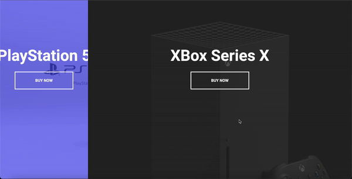

# Split Landing Page
This project is a split landing page design implemented using HTML, CSS, and JavaScript. It features a visually appealing layout with two sections that can be interactively expanded and collapsed.

## Preview

## Technologies Used

- HTML
- CSS
- JavaScript

## Features

- Split screen layout
- Interactive expanding/collapsing sections
- Smooth animations
- Responsive design

## Getting Started

To get started with this project, follow these steps:

1. Clone the repository.
2. Open the `index.html` file in your preferred web browser.
3. Customize the project according to your needs.

## Acknowledgement

The project is part of the "50 projects in 50 days - HTML, CSS & Javascript" course on Udemy by Brad Traversy.

